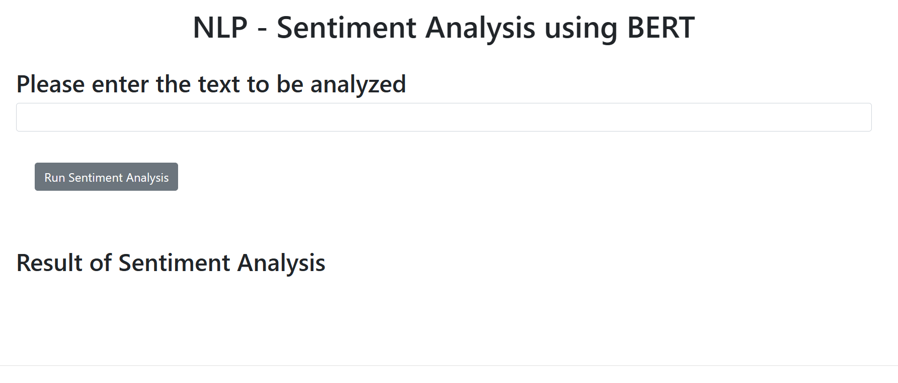

<div align="center">

# BERT Sentiment Analyzer 🤖

An end-to-end Natural Language Processing (NLP) web application that uses a fine-tuned BERT model to classify text sentiment. This project demonstrates the integration of heavy-duty AI models with a lightweight Flask backend and a responsive HTML/JS frontend.



---

## 💡 Overview
</div>

This tool allows users to input any sentence and receive a real-time sentiment analysis (**Positive / Negative / Neutral**) powered by the BERT (*Bidirectional Encoder Representations from Transformers*) architecture. 

As a developer with a background in **pre-medicine**, I am particularly interested in how these NLP techniques can be applied to healthcare—such as analyzing patient feedback or monitoring mental health through text-based journals.


<div align="center">

## 🛠️ Tech Stack
</div>

* **AI Model:** BERT (via Hugging Face Transformers)
* **Backend:** Python / Flask
* **Frontend:** HTML5, CSS3, JavaScript (Fetch API)
* **Deployment:** Render / Hugging Face Spaces

<div align="center">

## 📂 Project Structure
</div>

* `server.py`: The Flask server that handles routing and model inference.
* `SentimentAnalysis/`: Contains the logic for the BERT model wrapper.
* `static/`: Contains `mywebscript.js` for asynchronous frontend updates.
* `templates/`: Contains the `index.html` file for the UI.

<div align="center">

## ⚙️ How to Run Locally
</div>

1. **Clone the repo:**
   ```bash
   git clone https://github.com/Nauman123-coder/bert-sentiment-analyzer.git
